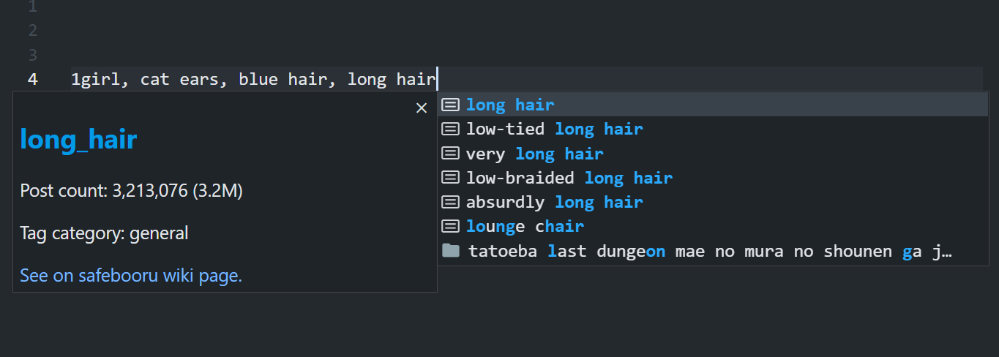

# Booru Tags Completion Extension for VSCode


This extension provides completion of booru tags. 

## Features

- Danbooru tag completion
  - General tags, character tags, copyright tags, artist tags and meta tags
- Registration of custom tags (e.g. `masterpiece`, `best quality`)



## Extension Settings

This extension contributes the following settings:

* `booru-tags.useGeneralTags`: Show general tags in completion suggestions. (e.g. `1girl`, `looking at viewer`)
* `booru-tags.useCharacterTags`: Show character tags in completion suggestions. (e.g. `hakurei reimu`, `hatsune miku`)
* `booru-tags.useCopyrightTags`: Show copyright tags in completion suggestions. (e.g. `touhou`, `vocaloid`)
* `booru-tags.useArtistTags`: Show artist tags in completion suggestions. 
* `booru-tags.useMetaTags`: Show meta tags in completion suggestions. (e.g. `highres`, `jpeg artifacts`)
* `booru-tags.withUnderscore`: Use tags with underscores. (e.g. use `looking_at_viewer` instead of `looking at viewer`)
* `booru-tags.trailingComma`: Add trailing comma after tags. (e.g. complete like `solo, ` instead of `solo`)
* `booru-tags.customTags`: Add custom tags to completion suggestions.
* `booru-tags.filesToEnable`: Specify file extensions to enable this extension.

> Note: If you are trying to use this extension with files with some extensions like `.md` or `.toml`, you will need the following settings in `settings.json` to enable completion:
> ```json
>{
>    "[markdown]": { // or such as [toml]
>        "editor.quickSuggestions": {
>            "comments": "on",
>            "strings": "on",
>            "other": "on"
>        }
>    }
>}
>```

<!-- ## Known Issues

 -->

## Release Notes

### 1.0.0

Initial release.

---

